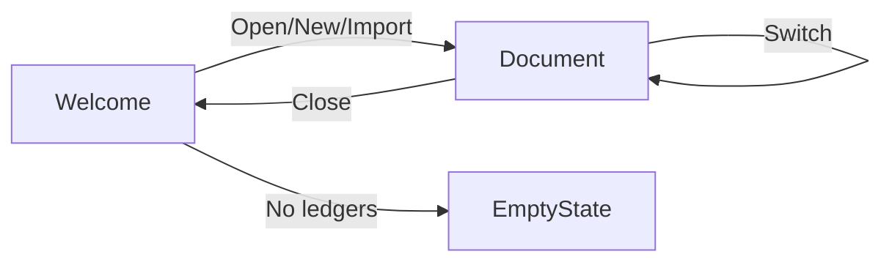

# Budgie Document Model Design

## Overview
Transform Budgie from an "always-open" ledger app to a document-based application similar to traditional desktop apps (Word, Excel, etc.) but running in the browser.

## Application States

### 1. **Welcome State** (No Active Ledger)
The default state when:
- App first loads
- User closes current ledger
- No ledgers exist yet

**UI Elements:**
```
┌──────────────────────────────────────────┐
│            🏦 Budgie                     │
│                                          │
│         Welcome to Budgie                │
│    Your Personal Finance Manager         │
│                                          │
│  ┌────────────────────────────────┐     │
│  │  📁 Recent Ledgers              │     │
│  ├────────────────────────────────┤     │
│  │ • Personal 2024                │     │
│  │   Last edited: 2 hours ago     │     │
│  │   12 transactions              │     │
│  │                                │     │
│  │ • Business Expenses            │     │
│  │   Last edited: Yesterday       │     │
│  │   45 transactions              │     │
│  │                                │     │
│  │ • Vacation Fund                │     │
│  │   Last edited: 3 days ago      │     │
│  │   8 transactions               │     │
│  └────────────────────────────────┘     │
│                                          │
│  [➕ New Ledger]  [📂 Open from Network] │
│  [📥 Import]      [🔍 Browse All]        │
└──────────────────────────────────────────┘
```

### 2. **Document State** (Ledger Active)
When a ledger is open:

**UI Elements:**
```
┌──────────────────────────────────────────┐
│  Budgie / Personal 2024  [✖ Close]   [☰]│
├──────────────────────────────────────────┤
│  [Transaction Table...]                   │
│                                           │
│  Modified indicator: •                    │
│  Network sync: 🟢 Connected              │
└──────────────────────────────────────────┘
```

## State Transitions



## Data Model Enhancements

### Ledger Metadata
```javascript
{
  "expense_tracker_metadata": {
    "ledgers": [
      {
        "name": "Personal 2024",
        "lastModified": "2024-01-15T10:30:00Z",
        "lastOpened": "2024-01-15T10:30:00Z",
        "transactionCount": 12,
        "totalDebits": 1500.00,
        "totalCredits": 2000.00,
        "currentBalance": 500.00,
        "isNetworkFile": false,
        "networkPath": null,
        "isPinned": false
      }
    ],
    "currentLedger": null, // null = welcome state
    "recentFiles": [
      {
        "path": "/network/budgets/2024.budgie",
        "name": "Budget 2024",
        "lastAccessed": "2024-01-14T15:00:00Z"
      }
    ]
  }
}
```

## Key Features

### 1. Close Ledger
- Saves current state
- Clears the active ledger
- Returns to Welcome screen
- Updates last modified timestamp

### 2. Recent Ledgers
- Shows up to 10 most recently accessed
- Displays last modified time
- Shows transaction count
- Quick open on click
- Pin favorites to top

### 3. Network Integration
- Remember network file associations
- Show sync status in document mode
- Auto-reconnect to network files
- Warn before closing modified network files

### 4. Modified Indicator
- Show unsaved changes indicator
- Prompt to save before closing
- Auto-save for local storage
- Manual save for network files

## Implementation Plan

### Phase 1: Core State Management
1. Add app state manager
2. Implement welcome screen
3. Add close ledger functionality
4. Track metadata for all ledgers

### Phase 2: UI Components
1. Design and build welcome screen
2. Add close button to header
3. Create recent ledgers list
4. Add modified indicator

### Phase 3: Enhanced Features
1. Implement pinned ledgers
2. Add search/filter for ledgers
3. Quick preview on hover
4. Keyboard shortcuts (Cmd+W to close)

## User Workflows

### Opening a Ledger
1. User sees Welcome screen with recent ledgers
2. Clicks on a ledger or uses Open button
3. Ledger loads and replaces welcome screen
4. Header shows ledger name and close button

### Creating New Ledger
1. From Welcome: Click "New Ledger"
2. Enter name in dialog
3. Ledger opens immediately
4. Added to recent list

### Closing a Ledger
1. Click Close button (X) or Cmd+W
2. If modified, prompt to save
3. Return to Welcome screen
4. Ledger appears in recent list

### Switching Ledgers
1. Use hamburger menu → "Switch Ledger"
2. Shows mini recent list
3. Select different ledger
4. Current ledger closes, new one opens

## Benefits

1. **Clear Mental Model**: Users understand what's open
2. **Better Import UX**: Clear feedback when importing
3. **Multi-Ledger Workflow**: Easy to work with multiple ledgers
4. **Network File Clarity**: Know when working with network files
5. **Reduced Confusion**: No auto-loading surprises

## Technical Considerations

### Storage Keys
```javascript
// Current (confusing)
expense_tracker_active_ledger // Auto-loads

// New (clear)
expense_tracker_session: {
  currentLedger: "Personal 2024" | null,
  lastActivity: "2024-01-15T10:30:00Z"
}
```

### Backward Compatibility
- Migrate existing data on first load
- Preserve all ledger data
- Update metadata structure
- No data loss

### Performance
- Lazy load ledger data
- Cache recently accessed
- Preload metadata only
- Quick switching

## Visual Design

### Welcome Screen
- Clean, modern interface
- Card-based recent ledgers
- Clear action buttons
- Helpful empty state

### Document Mode
- Minimal chrome
- Clear ledger identification
- Visible close option
- Status indicators

## Keyboard Shortcuts

| Shortcut | Action |
|----------|--------|
| Cmd/Ctrl+N | New Ledger |
| Cmd/Ctrl+O | Open |
| Cmd/Ctrl+W | Close |
| Cmd/Ctrl+S | Save (network) |
| Cmd/Ctrl+Tab | Switch Ledger |

## Migration Path

1. **Detection**: Check for old data structure
2. **Migration**: Build metadata from existing ledgers
3. **Update**: Set currentLedger to null (welcome)
4. **Inform**: Show one-time explanation